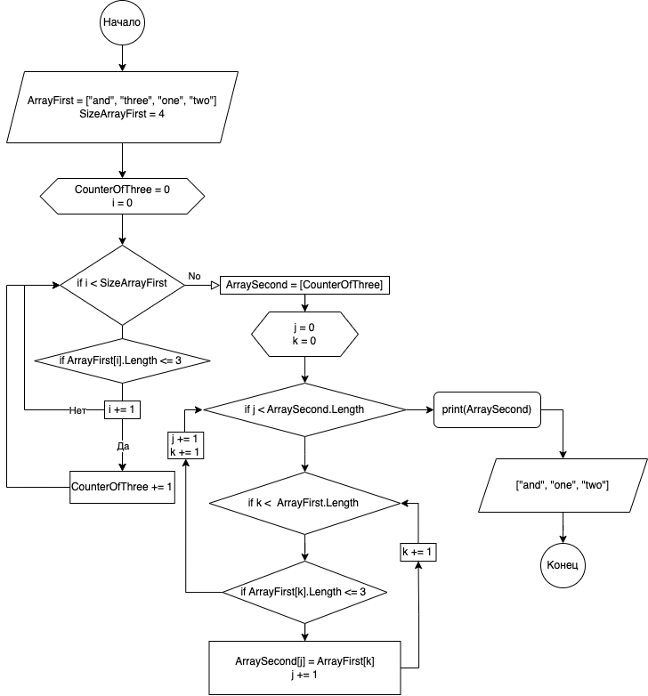

# ControlWork
## Контрольная работа для проверки знаний и навыков по итогу прохождения первого блока обучения на программе разработчик.

## __Блок-схема алгоритма.__

## __Описание работы программы.__
### 1. В первой методе, который называется __CreatArray__, создается массив.
> В теле данного метода указывается длина массива с помощью запроса на ввод длины через терминал, далее в цикле идет заполнения массива по каждому индексу через терминал, а после цикла идет возврат созданного метода через return.

### 2. В методе под названием __NewArrayOfThree__ из уже созданного массива строк, формируется новый массив из строк, длина которых меньше либо равна трем символам.
> В теле метода создается переменная счетчик __CounterOfThree__ со значением ноль, которая отправляется в цикл с условием того, что если в созданном массиве есть строка из трех или менее символов, то к переменной прибавляется единица, так мы получаем переменную со значением о количестве в массиве строк равной трем или менее символов. Данная переменная __CounterOfThree__ используется для задания длины нового массива. Также в теле метода создается внешний и вложенный в него цикл с перебором индексов первого и второго массива, а также для заполнения второго массива строкой с длиной менее или равной трем символам. После циклов идет возврат нового массива.

### 3. В методе __PrintArray__ идет вывод одномерного массива в терминал.
> В теле идет простой перебор индексов переданного массива через цикл for с выводом значения под этим индексом.
